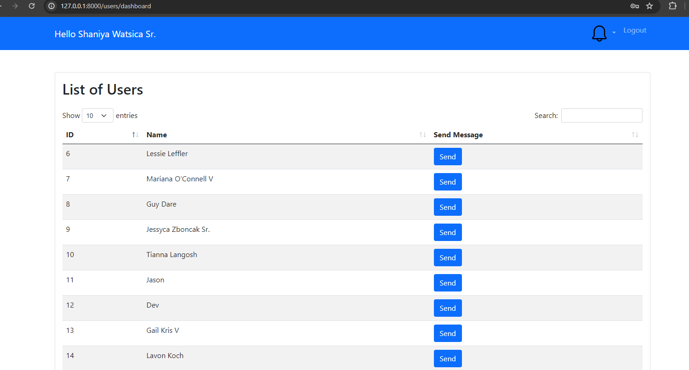
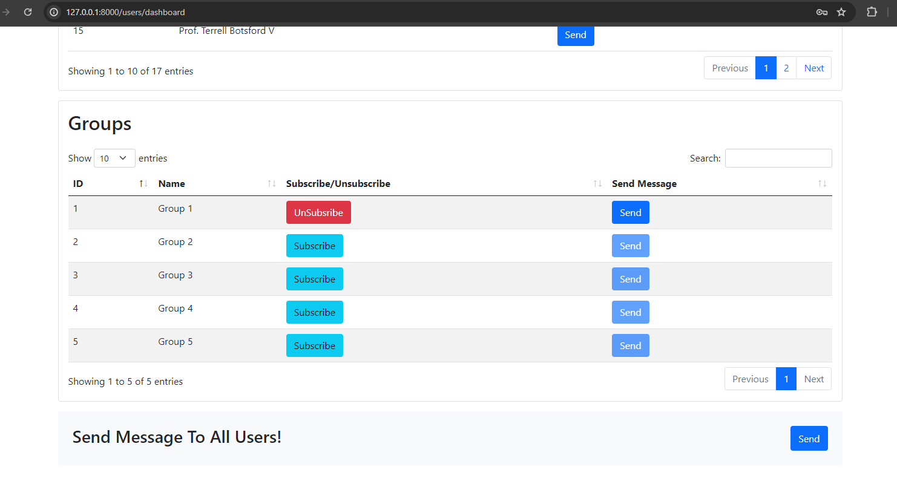
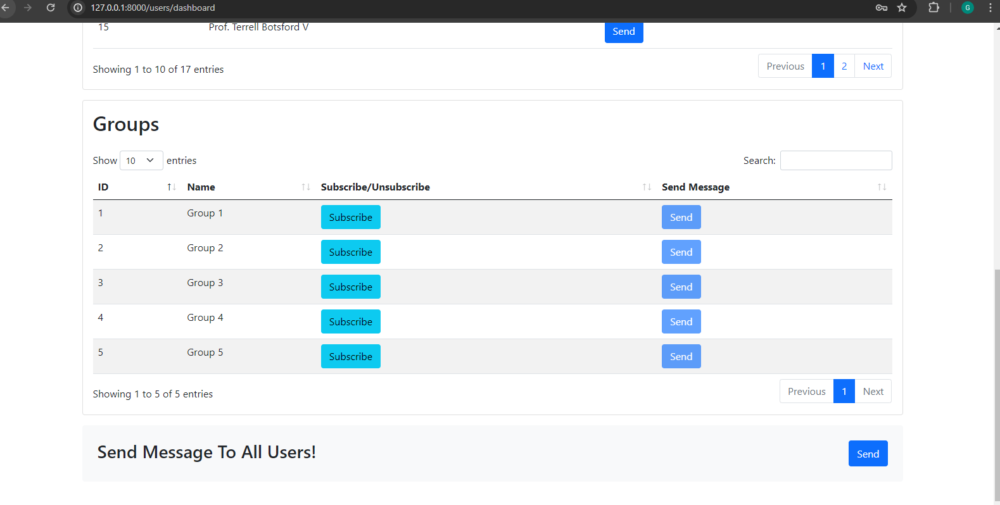
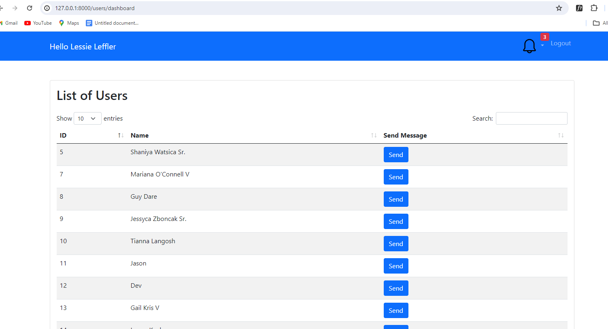
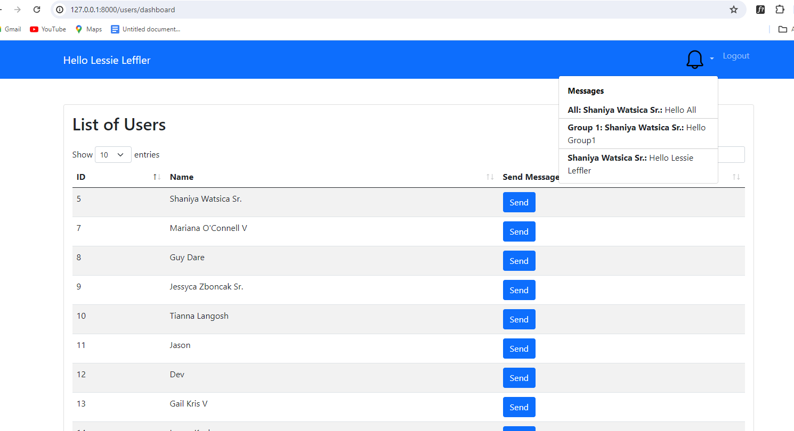

# Setting up WebSockets in Laravel

This guide will walk you through the steps to set up WebSockets in a Laravel application.
## Prerequisites

- Laravel >= 8.8
- PHP >= 8.1
- Composer (for package management)
- Node.js (for Laravel Echo)

## Installation
1. Run the composer install to setup necessary packages:

   ```bash
   composer install

2. Run the migrations:

   ```bash
   php artisan migrate
     
3. Run the seeders:

   ```bash
   php artisan db:seed 
   
  
4. Update your .env file with your Pusher credentials and AES encryption key:
     ```bash
    PUSHER_APP_ID=test
    PUSHER_APP_KEY=test
    PUSHER_APP_SECRET=test
    PUSHER_APP_CLUSTER=mt1
    LARAVEL_WEBSOCKETS_HOST=127.0.0.1
    LARAVEL_WEBSOCKETS_SCHEME=http
    LARAVEL_WEBSOCKETS_PORT=6001
    ENCRYPTION_KEY=xxxxxxx

5. Starting the local Server
   ```bash
   php artisan serve   
6. Starting the WebSocket Server
   ```bash
   php artisan websockets:serve
7. Run the Queue using the following Artisan command:
    ```bash
    php artisan queue:work
    
    
8. Run the testcases using the following Artisan command :
    ```bash
   php artisan test

9. For Code coverage run the following Artisan command:
    ```bash
    vendor/bin/phpunit --coverage-html reports/
    
    
   
   
## Front-end setup

1. Install npm:
    ```bash
    npm install
  
2. Compile your assets :
     ```bash
     npm run dev

## Project Flow

1.Users should register and log in to access the dashboard page.

2.After successful login, users can view the dashboard below.
   

   
## Dashboard mainly consist of three features for users 
## One-to-One Messaging
        Follow these steps to send a message to a specific user:
        
        1. Select the Recipient: Choose the recipient's username from the list.
        2. Click Send Button: Click the "Send" button next to the selected username.
        3. Enter Message: Type your message in the provided text box.
        4. Send Message: Click the "Send Message" button to send your message.


## Group Messaging

        Users can view a list of available groups and subscribe to specific ones to send messages. Follow these steps:
        
        1. View Group List: Navigate to the "Groups" section to see the list of available groups.
        2. Subscribe to a Group: Click the "Subscribe" button next to the desired group.
        3. Click Send Button: Once subscribed, send button is enable for the desired group.
        4. Enter Message: Type your message in the provided text box.
        5. Send Message: Click the "Send Message" button to send your message to the group.


## Sending Messages to All Users

        To send a message to all users, follow these steps:
        
        1. Locate the Send Button: Find the "Send" button, typically located at the bottom of the user dashboard.
        2. Click Send Button: Click the "Send" button.
        3. Enter Message: Type your message in the provided text box.
        4. Send Message: Click the "Send Message" button to broadcast your message to all users.


## Viewing Received Messages

        Users can view received messages in the notification list. Follow these steps:
        
        1. Open Notification List: Click on the notification icon to open the notification list.
        2. View Received Messages: Browse through the list to see your received messages.


 


   
   
   
   
   
   
   
   
   
   
   
   
   
   
   
   
